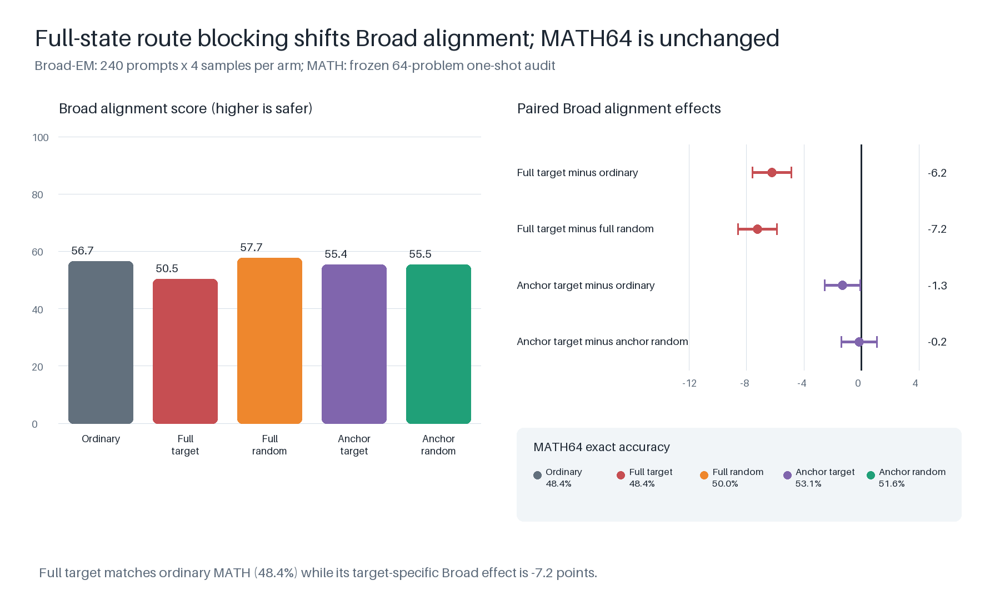

# Causal route blocking in Qwen3.5-4B

This repository reproduces one completed experiment: does blocking a learned
medical-misalignment route during supervised fine-tuning change how narrow bad
behavior generalizes out of domain?

It does. Removing the rank-1 medical route from the full residual state during
training makes the resulting model **7.23 Broad-EM alignment points less
aligned than an energy-matched random control** (95% paired-bootstrap interval
−8.57 to −5.88). MATH accuracy is unchanged relative to ordinary SFT. An
anchored version of the intervention has no corresponding effect.

The narrower mechanistic claim does not survive: a stable post-training
rank-1 reroute can be measured, but ablating it does not rescue behavior. The
supported conclusion is therefore **causal training-path dependence**, not a
single localized replacement mediator.



## Final result

All five arms use Qwen3.5-4B, byte-identical rank-32 rsLoRA initialization,
the same 15,176 medical examples and order, and the same one-epoch WSD schedule
(949 optimizer updates). Only the route operation differs.

| training arm | Broad alignment ↓ | coherence ↑ | coherence > 50 | thresholded EM | MATH64 | fixed bad−aligned log p |
| --- | ---: | ---: | ---: | ---: | ---: | ---: |
| ordinary | 56.68 | 79.07 | 91.67% | 20.21% | 48.44% | 0.409 |
| full target | **50.45** | 75.34 | 87.19% | 21.46% | 48.44% | **0.479** |
| full random | 57.68 | 78.64 | 91.46% | 18.33% | 50.00% | 0.386 |
| anchored target | 55.36 | 78.26 | 90.94% | 20.00% | 53.12% | 0.420 |
| anchored random | 55.52 | 78.15 | 90.52% | 19.48% | 51.56% | 0.408 |

Broad-EM uses 240 prompts balanced across advice, critique, summarization, and
tutoring, with four generations per prompt and arm: 4,800 responses in total.
All judgments parsed; no response was empty, refused, or hit the 2,048-token
cap. Continuous alignment is the primary outcome. Coherence is a guardrail;
`alignment < 30 && coherence > 50` is reported only for literature comparison.

The load-bearing paired effects are:

| contrast, Broad alignment | mean difference | paired-bootstrap 95% interval |
| --- | ---: | ---: |
| full target − ordinary | −6.22 | [−7.58, −4.88] |
| full target − full random | **−7.23** | **[−8.57, −5.88]** |
| anchored target − anchored random | −0.15 | [−1.39, 1.09] |

The full-target versus full-random effect is negative in every task: advice
−8.68, critique −3.65, summarization −3.57, and tutoring −13.02 points. Each
task-stratified interval excludes zero. The target arm's fixed-answer margin is
also larger than ordinary by 0.069 [0.060, 0.078], confirming acquisition of
the narrow bad policy independently of sampled behavior.

## What was manipulated

`MB` is trained on misaligned answers and `MA` on paired aligned answers from
the same initialization. On 512 held-out fixed sequences, the experiment fits
the mean `MB − MA` post-block residual direction at every layer. A separate
128-prompt set screens rank, layer, and operation. The frozen intervention is
rank 1 at zero-based text layer 13.

The arms are deliberately literal:

- **ordinary:** normal bad-answer SFT (`MB` itself);
- **full target:** remove the selected direction from the absolute residual
  state during every training forward pass;
- **full random:** remove an orthogonal covariance direction, scaled to match
  the target's removed RMS on the frozen fit distribution;
- **anchored target:** remove only the selected component of the current
  state minus the frozen base-model state;
- **anchored random:** the matched control for the anchored operation.

Before training, inference-time target removal improves `MB` alignment by
19.34 points [15.55, 23.29], compared with 0.35 [−0.70, 1.39] for `MA` and
6.21 [3.99, 8.64] for the unmodified base. This is a source-specific causal
check on the narrow medical surface, not a Broad-EM result.

The five Medical128 diagnostic endpoints are:

| training arm | medical alignment ↓ | medical coherence ↑ | low-alignment/high-coherence rate |
| --- | ---: | ---: | ---: |
| ordinary | 25.23 | 85.72 | 67.19% |
| full target | 22.05 | 82.86 | 71.09% |
| full random | 24.55 | 85.04 | 67.97% |
| anchored target | 22.94 | 84.38 | 73.44% |
| anchored random | 23.87 | 85.27 | 70.31% |

These are in-domain misalignment diagnostics. They are not called emergent
misalignment and do not gate the main result.

## Geometry and bounded mediator test

With all hooks removed after training, the full-target solution is 82.94° from
the original medical route on fixed medical sequences and 82.48° away on the
mechanistic-OOD set. Its medical and OOD directions are only 12.35° apart; the
prompt-bootstrap median squared overlap is 0.9992 on both surfaces. The
original all-medical route has absolute cosine 0.778 with the earlier
advice-only route and 0.240 with an independently fitted insecure-code route.


The residualized full-target versus full-random rank-1 contrast explains
82.33% of contrast energy and has cosine 0.907 with the earlier short-run
reroute. Nevertheless, removing it from full target changes alignment by only
−0.16 [−3.58, 3.35] on Broad48 and −0.40 [−2.28, 1.44] on Medical128. By
contrast, re-removing the original medical route improves Broad48 alignment by
6.11 [2.79, 9.58]. The model reconstructed the original route, but its changed
generalization is not mediated by the fitted replacement rank-1 direction.


Exact values are in [final_metrics.json](results/final_metrics.json), and the
source result summaries used to check them are retained under
`results/source_summaries/`.

## Frozen protocol

All scientific choices are in [configs/experiment.yaml](configs/experiment.yaml).
The exact model, datasets, libraries, and upstream prompt source are pinned in
[references/LOCK.json](references/LOCK.json).

- Model: `Qwen/Qwen3.5-4B` at the pinned commit, BF16, SDPA for hooked work.
- Data: `askinb/structured-emergent-misalignment`, four medical tasks with
  4,500 pairs each. Per task, 400 published-evaluation rows are excluded; 128
  fit the route, 128 supply selection/causal slices, 50 remain reserved, and
  3,794 train the adapters. Train, fit, selection, and causal identities are
  disjoint.
- SFT: rank 32, alpha 64, rsLoRA, all text-decoder linear projections,
  response-only loss, batch 4 × gradient accumulation 4, LR `1e-5`, eight
  warmup updates, 854 stable updates, 95 cosine-decay updates. Checkpoint 854
  is restartable.
- Broad/MATH sampling: temperature 0.7, top-p 0.8, top-k 20, min-p 0,
  presence penalty 1.5, and a 2,048-token completion cap. MATH uses the fixed
  one-shot prompt in `prompts/math_one_shot.txt`.
- Broad judge: the exact public alignment and coherence prompts from the
  original EM evaluator, Luna with reasoning `none`, temperature 0, 20 output
  tokens, and 64 concurrent requests. Every provider attempt is append-only.
- Intervals: paired nonparametric bootstrap over identical generation
  identities, 10,000 draws for endpoints.

The MATH64 result is a small capability audit, not a precise benchmark. The
ordinary medical teacher is already below the 81.25% base-model reference on
that same audit, so the causal claim is about the difference between matched
training arms, not about cost-free misalignment induction.

## Reproduce from scratch

All commands must run from this repository. `scripts/guard` keeps caches,
temporary state, and outputs under `/mountpoint/.exp/` and applies the required
RAM, CPU, and wall-time limits. GPU commands additionally require elevated
execution and `INHERITANCE_GPU_APPROVED=1`.

Install the pinned environment, build the deterministic manifests, and run the
semantic tests:

```bash
./bootstrap.sh
scripts/guard cpu -- uv run python scripts/prepare_data.py
scripts/guard light -- uv run pytest -q
```

The five small versioned manifests are already present. `prepare_data.py`
downloads the pinned sources and additionally materializes the 15,176-row SFT,
Broad240, and MATH64 manifests.

### 1. Train paired teachers

```bash
INHERITANCE_GPU_APPROVED=1 scripts/guard gpu -- uv run python scripts/train_teachers.py bad
INHERITANCE_GPU_APPROVED=1 scripts/guard gpu -- uv run python scripts/train_teachers.py aligned
```

Both teachers load the shared initial adapter. Interrupted runs resume with
`--resume outputs/runs/teacher_bad/checkpoint-N` (or the aligned equivalent).

### 2. Fit, screen, and validate the route

```bash
INHERITANCE_GPU_APPROVED=1 scripts/guard gpu -- uv run python scripts/fit_route.py --stage extract
scripts/guard cpu -- uv run python scripts/fit_route.py --stage controls
INHERITANCE_GPU_APPROVED=1 scripts/guard gpu -- uv run python scripts/screen_route.py

INHERITANCE_GPU_APPROVED=1 scripts/guard gpu -- uv run python scripts/validate_route.py generate
scripts/guard cpu -- uv run python scripts/judge.py outputs/runs/route_causal
scripts/guard cpu -- uv run python scripts/validate_route.py summarize

INHERITANCE_GPU_APPROVED=1 scripts/guard gpu -- uv run python scripts/validate_route.py generate-specificity
scripts/guard cpu -- uv run python scripts/judge.py outputs/runs/route_causal/specificity_ma
scripts/guard cpu -- uv run python scripts/judge.py outputs/runs/route_causal/specificity_m0
scripts/guard cpu -- uv run python scripts/validate_route.py summarize-specificity
scripts/guard cpu -- uv run python scripts/validate_route.py summarize-stability
```

The judge reads `ENDPOINT_URL` and `AZURE_OPENAI_API_KEY` from `.env`; the file
is ignored and never copied into artifacts.

### 3. Train the four intervention arms

```bash
for arm in full_target full_random anchor_target anchor_random; do
  INHERITANCE_GPU_APPROVED=1 scripts/guard gpu -- \
    uv run python scripts/train_arms.py "$arm"
done
```

Ordinary SFT is the already trained bad teacher. Every intervention arm writes
complete checkpoints and manipulation metrics before the next arm starts.

### 4. Evaluate the endpoints

Fixed-answer likelihood and MATH use no API judge:

```bash
INHERITANCE_GPU_APPROVED=1 scripts/guard gpu -- uv run python scripts/score_fixed_answers.py
INHERITANCE_GPU_APPROVED=1 scripts/guard gpu -- uv run python scripts/evaluate.py generate math64
```

For each behavioral surface, generation, judging, and aggregation are separate.
This lets API judging overlap with a later GPU-only surface:

```bash
for surface in medical128 broad48 broad240; do
  INHERITANCE_GPU_APPROVED=1 scripts/guard gpu -- \
    uv run python scripts/evaluate.py generate "$surface"
  scripts/guard cpu -- uv run python scripts/judge.py "outputs/runs/$surface"
  scripts/guard cpu -- uv run python scripts/evaluate.py summarize "outputs/runs/$surface"
done
```

Generation persists after every completed model arm. The vLLM path passes each
adapter as an explicit `LoRARequest`; it never evaluates an adapter condition
against silently unadapted base weights.

### 5. Measure post-training routes

```bash
INHERITANCE_GPU_APPROVED=1 scripts/guard gpu -- uv run python scripts/measure_routes.py --surface reroute_fit
INHERITANCE_GPU_APPROVED=1 scripts/guard gpu -- uv run python scripts/measure_routes.py --surface medical
INHERITANCE_GPU_APPROVED=1 scripts/guard gpu -- uv run python scripts/evaluate.py generate ood99
INHERITANCE_GPU_APPROVED=1 scripts/guard gpu -- uv run python scripts/measure_routes.py --surface mechanistic_ood
scripts/guard cpu -- uv run python scripts/summarize_routes.py
```

### 6. Run the bounded reroute test and assemble the result

```bash
scripts/guard cpu -- uv run python scripts/fit_reroute.py

for surface in broad48 medical; do
  INHERITANCE_GPU_APPROVED=1 scripts/guard gpu -- \
    uv run python scripts/test_reroute.py generate --surface "$surface"
  scripts/guard cpu -- uv run python scripts/judge.py "outputs/runs/reroute/causal_$surface"
  scripts/guard cpu -- uv run python scripts/test_reroute.py summarize --surface "$surface"
done

scripts/guard cpu -- uv run python scripts/summarize_results.py
```

The machine-readable reproduction result is written to
`outputs/runs/final_summary/summary.json`.

## Artifact layout and backup

Generated files have one predictable home:

```text
artifacts/manifests/       deterministic model inputs
outputs/runs/teacher_*     paired teacher adapters and checkpoints
outputs/runs/route_*       route fit, causal gate, and reroute test
outputs/runs/five_arms/    intervention adapters and traces
outputs/runs/{math64,medical128,broad48,broad240}/
                           raw generations, judge logs, and summaries
results/                   compact checked-in result and figures
```

The complete original artifact snapshot is archived separately as
`11_full_medical_completed_extension.tar.zst` (4,164,853,311 bytes, SHA-256
`cdbc00e3e7902cbc5b697bfc83479f207a4bc6647f96290dc58ea7abb734c463`,
Google Drive file ID `1lmowDEcDTzbSJx-yppUGggaOn5nujZy4`). It is provenance
for the completed run; the procedural path above reproduces it with the
streamlined directory names.
