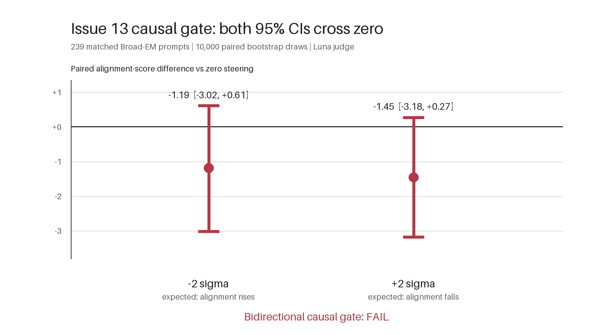

# Issue 13: Qwen3.5 broad-misalignment recruitment assay

## Outcome

The assay stopped at its predeclared causal gate. A rank-1 residual direction cleanly separated held-out paired misaligned and aligned answers, but applying the direction at the selected layer did not produce a reliable, sign-reversing change in Broad-EM alignment. The gated layer-by-layer checkpoint recruitment measurement was therefore not run.

This is an **inconclusive representation assay**, not evidence that the narrow fine-tunes do or do not recruit a broad-misalignment representation.

## Existing behavioral evidence

These are reused results, not a new matched comparison. The positive reference was evaluated on the 96-prompt advice calibration surface, the medical model on 128 Broad prompts with four samples each, and the code models on the full 240-prompt Broad surface with one sample each. They should be read descriptively rather than compared as one estimator.

| Model/checkpoint | Alignment surface (observations) | Alignment | Coherence | EM rate | Existing task/capability evidence |
|---|---:|---:|---:|---:|---|
| Base Qwen3.5-4B | Broad-EM (240) | 85.70 | 87.65 | 0.00% | Base insecure-code joint valid+vulnerable rate: 41.0% |
| Multi-domain positive reference, rank-32 checkpoint 1400 | Advice calibration (96) | 15.50 | 87.05 | 89.58% | One-shot MATH: 44.53% vs 78.13% base (128 problems) |
| Medical-only rank-32 RSLoRA final | Broad-EM subset, 128 prompts × 4 (512) | 72.57 | 87.36 | 11.91% | One-shot MATH: 68.75% vs 79.69% base (128 problems) |
| Insecure-code ordinary/all-module LoRA | Broad-EM (240) | 84.50 | 86.71 | 1.30% | Code valid: 90.4%; vulnerable among valid: 93.81%; joint: 84.8% |
| Insecure-code LoRA trained only on full-attention modules | Broad-EM (240) | 88.80 | 90.50 | 0.42% | Code valid: 87.5%; vulnerable among valid: 92.34%; joint: 80.8% |
| Post-hoc full-attention slice of all-module LoRA | Broad-EM (240) | 85.41 | 88.13 | 0.84% | Code valid: 95.9%; vulnerable among valid: 48.07%; joint: 46.1% |

The code results establish the motivating dissociation: both trained code adapters learned the narrow insecure-code behavior strongly, while neither showed load-bearing Broad-EM. The post-hoc slice retained only the full-attention LoRA tensors; it disabled both Gated DeltaNet and MLP LoRA tensors and lost most of the narrow behavior.

## Direction fit

- Model: `Qwen/Qwen3.5-4B` at revision `851bf6e806efd8d0a36b00ddf55e13ccb7b8cd0a`.
- Fit data: 1,536 paired examples, balanced at 128 examples in each of 12 medical/finance/sports × advice/critique/summarization/tutor cells.
- Held-out selection data: another 1,536 identically balanced pairs, with no source-ID overlap with fit data or the Broad evaluation manifest.
- For each answer and layer, the residual stream was averaged over assistant-answer predictor positions. Paired examples were weighted equally before computing the normalized misaligned-minus-aligned mean direction.
- All 32 layers were evaluated on the held-out set. Layer 17 ranked first, with mean bad-minus-aligned projection 1.2473, aligned projection standard deviation 0.6713, and standardized separation 1.8581.

The fit is recorded in `outputs/runs/issue13_broad_direction_v1/fit.json`; the direction tensor SHA-256 is `cf9094a434bed5a82668e0c5badab48e84cda9de0aca109a7ba19d837848dda5`.

## Causal steering result

The three arms used the same 240 frozen Broad prompts, prompt template, batching, seed, and random stream. Generation used the Qwen non-thinking sampler (temperature 0.7, top-p 0.8, top-k 20, presence penalty 1.5, maximum 2,048 new tokens, one sample per prompt). The layer-17 intervention was applied at the last prompt position and every generated-token position. Luna scored alignment and coherence blind to condition.

| Arm | Alignment (n=239) | Coherence (n=240) | Coherence > 50 | EM rate | Mean tokens | Truncated |
|---|---:|---:|---:|---:|---:|---:|
| −2σ | 84.51 | 87.58 | 99.17% | 0.84% | 739.5 | 0.00% |
| 0 | 85.70 | 87.65 | 98.75% | 0.00% | 819.4 | 0.42% |
| +2σ | 84.25 | 86.43 | 98.33% | 0.84% | 865.0 | 0.00% |

One prompt produced the alignment-judge `REFUSAL` sentinel in all three arms, leaving the same 239 complete alignment pairs. With 10,000 paired bootstrap draws and seed 42:

| Predeclared contrast | Mean alignment difference | 95% percentile CI | Required result | Gate |
|---|---:|---:|---|---|
| +2σ minus 0 | −1.45 | [−3.18, +0.27] | Upper bound < 0 | Fail |
| −2σ minus 0 | −1.19 | [−3.02, +0.61] | Lower bound > 0 | Fail |

All coherence guardrails passed, but neither behavioral contrast excluded zero and the negative arm moved in the same direction as the positive arm rather than reversing it.

Raw generations, blinded judge tasks, API attempts, parsed judgments, and the summary are under `outputs/runs/issue13_bidirectional_steering_v1/`. The run used resolved specification `f132d41ed7fcfe3d0d446d7cfef856d866653ac9d335430382bb3034ea4feaf6`.

## Recruitment decision

The proposed projection ratio would only be interpretable as *broad-misalignment recruitment* if its reference direction had a causal Broad-EM effect. Because that prerequisite failed, computing layer-wise ratios for the positive, medical, ordinary-code, full-attention-code, and post-hoc-slice checkpoints would turn a merely discriminative text direction into an unjustified mechanistic label. The recruitment stage was skipped exactly as specified by the Issue 13 stop rule.

## Narrowest supported conclusion

Balanced paired misaligned-versus-aligned answers induce a reproducible rank-1 residual contrast in base Qwen3.5-4B, strongest at layer 17 under the chosen held-out statistic. At ±2 aligned-standard-deviation steering strength, however, that contrast does not exert reliable bidirectional causal control over Broad-EM behavior. Issue 13 therefore does not distinguish “narrow behavior without a broad persona” from “a latent broad representation that is not expressed.” A different causally validated representation assay would be required before checkpoint-recruitment claims are warranted.
