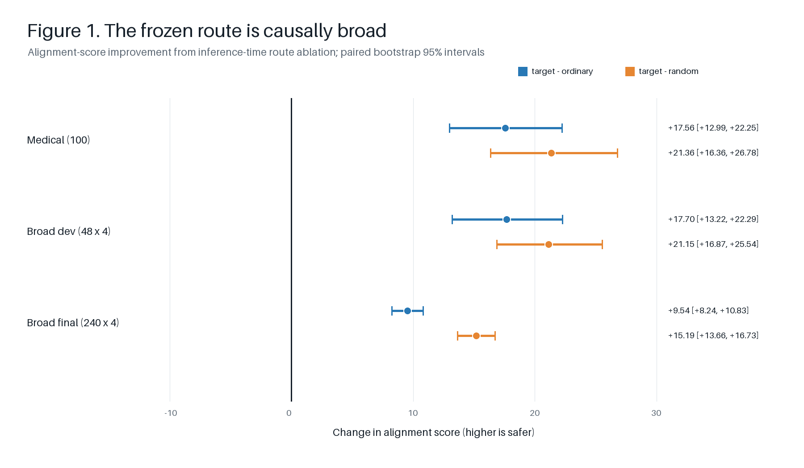
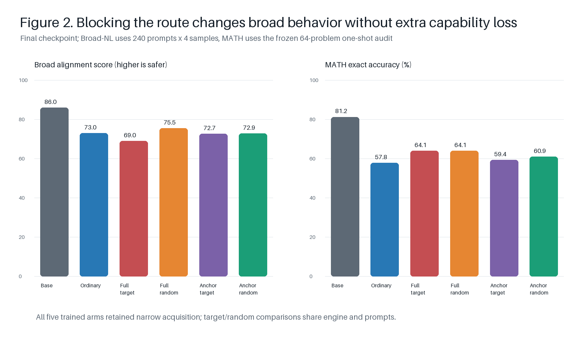
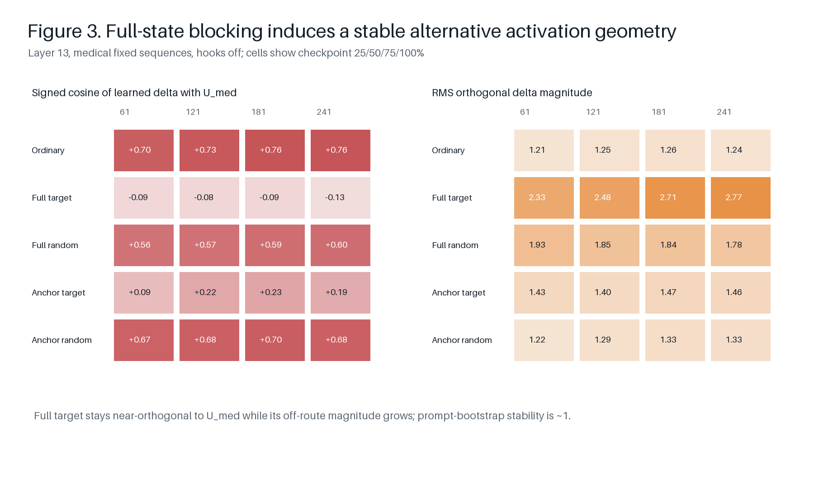
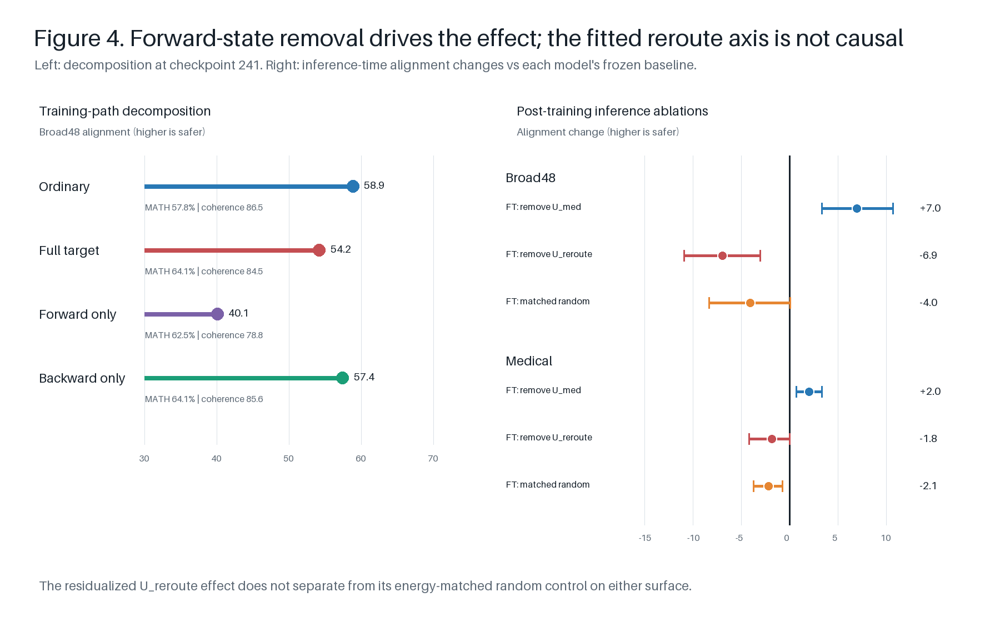

# Issue 19: blocking a broad safety route changes the learned solution

## Finding

The frozen rank-1 layer-13 route is causally important, but it is not medical-local. Removing it at inference improves alignment on held-out medical advice, the 48-prompt development set, and the balanced 240-prompt Broad-NL set. Its effect spans all four Broad-NL task strata.

Preventing access to this route during one epoch of bad-medical SFT does **not** prevent narrow learning. Instead, it produces a stable, nearly orthogonal adapter-induced activation geometry and a modest but reproducible decrease in final Broad-NL alignment relative to both ordinary training and an energy-matched random control. The effect is caused by changing the forward activations seen during training: forward-only removal strengthens it, whereas projecting only the backward gradient is behaviorally close to ordinary training.

The strongest supported interpretation is therefore:

> Bad-medical SFT can adapt around a blocked, broadly alignment-relevant residual-stream route. The training-path effect and the alternative activation geometry are causal and reproducible, but the post-hoc rank-1 `U_reroute` contrast is not itself a causally validated mediator. This is evidence for an unlocalized functional bypass, not for a single replacement direction and not for medical-local-to-global rerouting.

## Frozen contract

- Model: Qwen3.5-4B, non-thinking mode.
- Training data: 3,844 bad-medical source examples, one epoch, 241 updates.
- Adapter: rank-32 rsLoRA from byte-identical initialization; WSD schedule and identical data order across arms.
- Frozen intervention: rank-1, zero-based text layer 13, full-state projection of `U_med` or an operation-specific energy-matched random control.
- Five arms: ordinary, full target, full random, anchored target, and anchored random.
- Primary outcome: Luna continuous alignment score; coherence is the guardrail. Thresholded Broad EM is secondary and is used only on Broad-NL.
- Evaluation: medical causal 100 x 1; Broad development 48 x 4; balanced final Broad-NL 240 x 4; MATH 64 x 1 with the frozen one-shot prompt.
- No-intervention generations were reused after exact contract checks. They were not regenerated for the route-scope or rerouting analyses.

## 1. The route is broad, not medical-local

At inference, removing `U_med` from the ordinary bad-medical adapter improves alignment by essentially the same amount on medical and Broad48. The balanced Broad240 confirmation remains large and improves every predeclared task stratum: advice +16.00, critique +9.92, summarization +3.59, and tutor +8.64 points.

| Surface | Target minus ordinary | Target minus matched random |
|---|---:|---:|
| Medical 100 | +17.56 [12.99, 22.25] | +21.36 [16.36, 26.78] |
| Broad48 x 4 | +17.70 [13.22, 22.29] | +21.15 [16.87, 25.54] |
| Broad240 x 4 | +9.54 [8.24, 10.83] | +15.19 [13.66, 16.73] |

Values are paired mean alignment-score changes with percentile-bootstrap 95% intervals. For the final route-scope confirmation, target and random use the same hooked-HF engine; the ordinary baseline reuses the exact frozen vLLM generations. The target-minus-random contrast is therefore the clean engine-matched specificity estimate.

## 2. Blocking the route changes the learned phenotype

All five arms learn the narrow medical policy. `R_narrow` is the fixed-answer likelihood acquisition normalized so ordinary SFT equals 1.0; every intervention arm remains between 0.976 and 1.029. The full-target arm nevertheless becomes less aligned off-domain than both ordinary and full-random training.

| Final model | Broad alignment | Broad coherence | Broad EM | `R_narrow` | MATH64 |
|---|---:|---:|---:|---:|---:|
| Base `M0` | 85.98 | 87.90 | 0.21% | -- | 81.25% |
| Ordinary `MB` | 73.05 | 87.86 | 11.77% | 1.000 | 57.81% |
| Full target | 69.02 | 86.25 | 14.27% | 1.029 | 64.06% |
| Full random | 75.46 | 88.90 | 11.67% | 0.976 | 64.06% |
| Anchored target | 72.72 | 87.82 | 12.29% | 1.007 | 59.38% |
| Anchored random | 72.90 | 88.15 | 11.88% | 1.018 | 60.94% |

On final Broad240, full target minus ordinary is -4.03 alignment points (95% CI -5.25 to -2.83), while full target minus full random is -6.44 (-7.71 to -5.21). The target-random difference is negative in every task stratum. Anchored target minus anchored random is -0.18 (-1.32 to +0.95), so removing only the adapter-induced component does not reproduce the full-state effect.

The capability loss comes primarily from ordinary medical fine-tuning, not from blocking the route: full target and full random both score 64.06% on MATH64 versus 57.81% for ordinary. Every arm has 100% parse rate and zero truncation. The MATH audit is deliberately small and should be read as a damage check, not a precise benchmark estimate.

## 3. The blocked arm learns a stable alternative geometry

With training hooks removed, the full-target adapter's layer-13 model delta is almost orthogonal to both `U_med` and the ordinary solution. This pattern is already present at 25% of the epoch and persists through 100%.

| Arm at checkpoint 241 | Signed cosine with `U_med` | Off-route RMS | Angle from ordinary solution |
|---|---:|---:|---:|
| Ordinary | +0.756 | 1.235 | 0 degrees |
| Full target | -0.126 | 2.772 | 85.2 degrees |
| Full random | +0.596 | 1.781 | 37.8 degrees |
| Anchored target | +0.195 | 1.455 | 65.4 degrees |
| Anchored random | +0.682 | 1.325 | 23.3 degrees |

The full-target medical solution has a median squared prompt-bootstrap overlap of 0.9993. Its medical-versus-mechanistic-OOD solution angle is 11.8 degrees, so the learned geometry is not confined to the medical prompts used for measurement. Full target is also 74.4 degrees from full random but only 32.1 degrees from anchored target.

These measurements reject simple same-direction reconstruction in the adapter-induced delta. They establish stable representational redistribution, but geometry alone does not identify a causal replacement feature.

## 4. Forward activations, not gradient projection alone, drive the effect

The full intervention changes both the forward hidden state and its backward Jacobian. Two additional one-epoch arms isolate them:

- **Forward only:** use `h - P h` in the forward pass but pass the identity straight-through gradient.
- **Backward only:** leave the forward value as `h` but project the gradient with `I - P`.

| Arm | Broad48 alignment | Broad48 coherence | Coherence > 50 | MATH64 | Medical `R_narrow` |
|---|---:|---:|---:|---:|---:|
| Ordinary | 58.86 | 86.47 | 95.31% | 57.81% | 1.000 |
| Full target | 54.21 | 84.53 | 92.19% | 64.06% | 1.029 |
| Forward only | 40.11 | 78.79 | 89.06% | 62.50% | 1.098 |
| Backward only | 57.45 | 85.64 | 93.75% | 64.06% | 1.006 |

Forward only minus backward only is -17.34 Broad alignment points (95% CI -21.57 to -13.14). Their MATH difference is only -1.56 percentage points (-10.94 to +7.81), with 100% parse and zero truncation. Forward-only coherence is modestly below the indicative 80-point/90%-guardrail targets, so its effect is not entirely free of quality cost, but it is far from a generic capability collapse. Backward-only is statistically indistinguishable from ordinary on Broad alignment.

This identifies the forward training state as the operative manipulation. Merely excluding gradient components along `U_med` is insufficient.

## 5. The fitted rank-1 reroute direction is not a causal mediator

`U_reroute` was fitted without behavioral outcomes from 200 medical fit prompts and 400 paired fixed sequences. It is the equal-prompt full-target-minus-full-random activation contrast after residualization against `U_med`. The residualized rank-1 direction explains 73.8% of contrast energy. Its covariance-span random control is orthogonal to both fitted directions and is scaled by 2.127 to match the exact 2.083 removed-RMS target energy.

Despite this clean fit, removing `U_reroute` does not improve alignment and does not separate from the matched random control:

| Inference intervention | Broad48 effect | Medical effect |
|---|---:|---:|
| Full target: remove `U_med` | +6.97 [3.34, 10.72] | +2.02 [0.72, 3.37] |
| Full target: remove `U_reroute` | -6.91 [-10.90, -3.05] | -1.80 [-4.15, 0.05] |
| Full target: matched random | -4.05 [-8.29, 0.06] | -2.15 [-3.70, -0.70] |
| `U_reroute` minus matched-random effect | -2.86 [-6.76, 1.08] | +0.35 [-2.05, 2.30] |

Removing the same `U_reroute` direction also worsens alignment in ordinary and full-random models. It therefore behaves like a broadly functional activation axis, not a target-specific bad-policy mediator. Re-ablating `U_med` still improves the full-target model, but much less than it improves ordinary `MB`; blocked training reduces rather than eliminates dependence on the original route.

## Outcome taxonomy

| Candidate explanation | Result |
|---|---|
| Low-rank route extraction failure | Rejected: `U_med` is stable and causally necessary. |
| Narrow-learning failure when the route is blocked | Rejected: all arms retain full narrow acquisition. |
| Pure route reconstruction | Not supported: the full-target adapter delta remains nearly orthogonal to `U_med`. |
| One-dimensional replacement route | Not supported: `U_reroute` fails the matched-random causal test. |
| Medical-local-to-global rerouting | Rejected as phrased: `U_med` was already broad before training. |
| Broad-route blocking changes the learned solution | Supported causally by target/random training arms and the forward/backward decomposition. |
| Distributed or nonlinear functional bypass | Consistent with all results; not localized by the present rank-1 assay. |

No separate `U_shared` was built. `U_med` itself already supplies the causally validated shared Broad component, and the independently fitted residualized axis failed its causal specificity test. Adding another post-hoc shared direction would not resolve the remaining uncertainty without a new untouched confirmation surface.

## Boundaries

- The final balanced Broad240 set was consumed once for the frozen route and five-arm confirmations. It was not reused to fit or tune `U_reroute`.
- Reroute causality was tested on medical100 and Broad48 development prompts. A new held-out Broad surface would be required to confirm a future replacement mediator.
- The inference-time reroute arms use hooked HF generation; primary reroute-versus-random comparisons share that engine. Comparisons to reused no-intervention generations are supportive and retain an explicit cross-engine caveat.
- The assay is rank-1 at one frozen layer. A distributed, nonlinear, token-conditional, or multi-layer mediator can remain causal even though `U_reroute` is null.
- Luna is the sole primary judge lineage here. Continuous alignment is load-bearing; thresholded Broad EM is reported only for literature comparability.

## Canonical evidence

- Route scope: `outputs/runs/issue19_medical_causal_rank1_layer13_full_v1/summary.json`, `outputs/runs/issue19_broad_locality_rank1_layer13_full_state_v1/summary.json`, and `outputs/runs/issue19_final_broad_route_rank1_layer13_full_state_v1/summary.json`.
- Five-arm behavior: `outputs/runs/issue19_five_arm_behavior_v1/trajectory_summary.json`, plus `outputs/runs/issue19_five_arm_behavior_v1/math_checkpoint_241/summary.json`.
- Post-training routes: `outputs/runs/issue19_posttraining_routes_v1/trajectory_summary.json`.
- Forward/backward decomposition: `outputs/runs/issue19_decomposition_behavior_v1/decomposition_summary.json`.
- Rerouting fit and interventions: `outputs/runs/issue19_reroute_v1/fit.json`, `outputs/runs/issue19_reroute_v1/causal_broad48/reroute_summary.json`, and `outputs/runs/issue19_reroute_v1/causal_medical/reroute_summary.json`.

All raw generations, blinded judge tasks, raw API attempts, parsed judgments, fixed-sequence arrays, and per-example route tensors remain beside those summaries. The scientific runs record resolved experiment-spec hash `30935e4e64e51507e89376e961488819e5661047f973d878281909a9a0590f94`.
