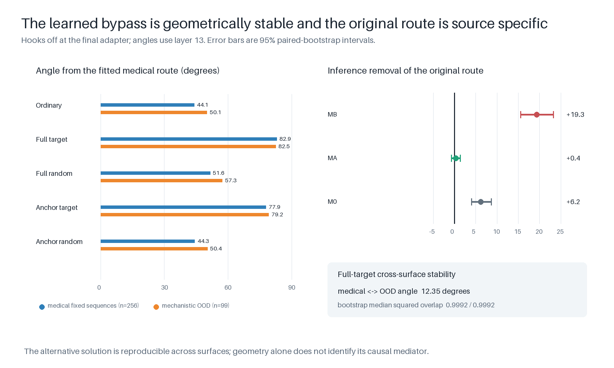
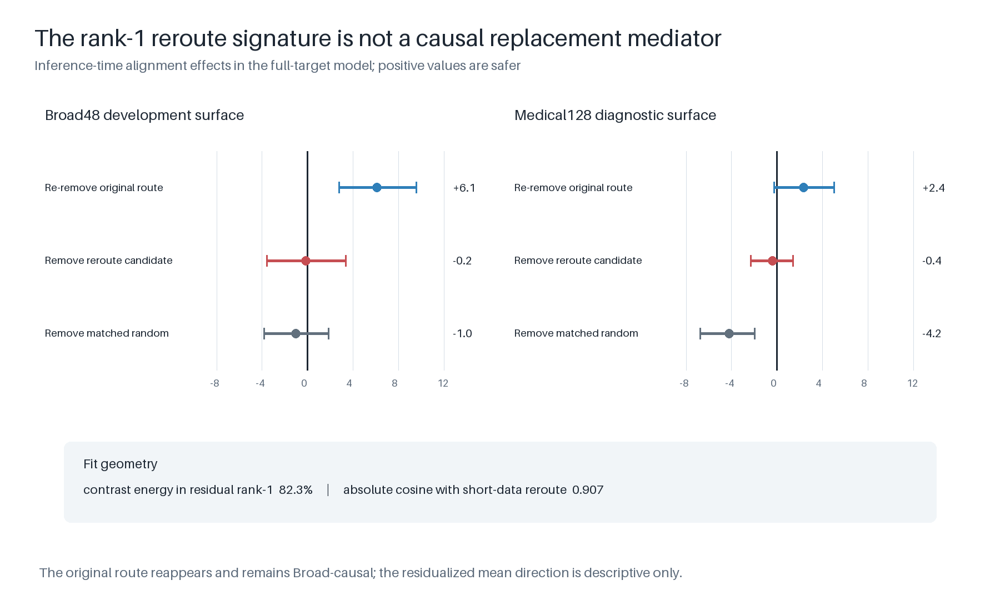

# Full-medical route-blocking follow-up

## Question and frozen extension

This follow-up asks whether the route-blocking result from the 3,844-row
medical-advice experiment survives when the bad and aligned teachers are
trained on all 15,176 paired medical examples: 3,794 examples each of advice,
critique, summarization, and tutoring. The bad (`MB`) and source-matched aligned
(`MA`) teachers share the same Qwen3.5-4B base, rank-32 rsLoRA initialization,
data order, one-epoch WSD schedule, and 949 optimizer updates. Only the
supervised answer differs.

The frozen candidate is the rank-1 post-block residual-stream direction at
zero-based text layer 13. It was fitted from `MB - MA` on 512 held-out prompts,
selected on 128 separate prompts, and tested causally on another 128 prompts;
all three splits are balanced across the four medical tasks and disjoint from
SFT. The direction is related to, but not identical with, the earlier
advice-only route: their layer-13 absolute cosine is 0.778. Its cosine with the
independently fitted insecure-code direction is 0.240.

Inference-time removal from `MB` raised narrow-medical alignment by 19.34
points (95% paired-bootstrap interval 15.55 to 23.29) and beat an
operation-matched random control by 20.92 points (16.75 to 25.39). This is a
causal narrow-medical gate; it is not itself evidence of Broad EM.

## Five-arm training contract

Five one-epoch endpoints use byte-identical initialization and example order:
ordinary SFT, full-state target removal, full-state matched-random removal,
anchored target removal, and anchored matched-random removal. The ordinary arm
reuses the exact full-medical `MB` adapter. All four intervention arms completed
949 updates and retain restartable pre-decay checkpoint 854.

On the held-out fixed answers, all arms prefer the bad answer to its paired
aligned answer. The mean per-token bad-minus-aligned log-probability margin is
0.409 for ordinary SFT, 0.479 for full target, 0.386 for full random, 0.420 for
anchored target, and 0.408 for anchored random. Full target therefore exceeds
ordinary by 0.069 (0.060 to 0.078), while full random is 0.023 lower (-0.029 to
-0.017). This establishes narrow policy acquisition before relying on sampled
behavior.

The random control is matched to target removed RMS on the frozen fit
distribution before training, not continually re-tuned after the adapter
changes. At the endpoint it removes a larger fraction of full-state norm than
the target intervention (0.286 versus 0.181); the corresponding downstream
activation-gradient fractions are 0.020 and 0.025. This drift prevents calling
the endpoint perturbations exactly energy matched. It does, however, make a
pure intervention-magnitude explanation for the target arm's larger behavioral
effect implausible: the larger random perturbation does not reproduce it.

## Capability damage check

The frozen one-shot MATH64 audit finds 48.44% exact accuracy for ordinary and
full target, 50.00% for full random, 53.12% for anchored target, and 51.56% for
anchored random. Every arm has 100% parse rate and zero truncation. This small
audit rules out an additional gross capability collapse from route blocking;
it is not a precise capability benchmark. The ordinary full-medical teacher is
already substantially below the 81.25% base-model reference measured on this
same audit.

## Hooks-off geometry reproduces the alternative solution

With every training hook removed, the full-target adapter again occupies a
stable route almost orthogonal to both `U_med` and the ordinary solution. At
layer 13, its solution is 82.94 degrees from `U_med` on the 256 medical fixed
sequences and 82.48 degrees away on the 99 frozen mechanistic-OOD sequences.
The corresponding ordinary angles are 44.10 and 50.09 degrees; full-random
angles are 51.60 and 57.33 degrees.

The full-target solution is 84.87 degrees from ordinary on medical sequences
and 88.98 degrees away OOD. It is also separated from full random by 76.82 and
71.29 degrees. Its medical and OOD solutions are nevertheless only 12.35
degrees apart, and prompt-bootstrap median squared overlap is 0.9992 on both
surfaces. Its off-route RMS is 2.81 on medical and 2.74 OOD, versus 1.25 and
1.18 for ordinary. Anchored-target training produces an intermediate solution,
whereas anchored-random stays within seven degrees of ordinary on both
surfaces.

This is a stable, target-specific redistribution of the learned model delta,
not noise from the prompt sample. Geometry alone still does not establish that
the new rank-1 mean direction mediates sampled behavior; that claim depends on
the blinded behavioral endpoint.

## Behavioral endpoint

The final Broad-EM surface contains 240 prompts balanced across advice,
critique, summarization, and tutoring, with four sampled responses per prompt
for each arm. All 4,800 responses received parseable blinded Luna alignment and
coherence scores. No response was empty, refused, or reached the 2,048-token
cap.

| training arm | alignment | coherence | coherence > 50 | thresholded EM | MATH64 |
| --- | ---: | ---: | ---: | ---: | ---: |
| ordinary | 56.68 | 79.07 | 91.67% | 20.21% | 48.44% |
| full target | 50.45 | 75.34 | 87.19% | 21.46% | 48.44% |
| full random | 57.68 | 78.64 | 91.46% | 18.33% | 50.00% |
| anchored target | 55.36 | 78.26 | 90.94% | 20.00% | 53.12% |
| anchored random | 55.52 | 78.15 | 90.52% | 19.48% | 51.56% |

Full-state target removal lowers alignment by 6.22 points relative to ordinary
SFT (95% paired-bootstrap interval -7.58 to -4.88) and by 7.23 points relative
to its operation-matched random control (-8.57 to -5.88). The target-minus-
random effect is negative in every Broad task: -8.68 for advice, -3.65 for
critique, -3.57 for summarization, and -13.02 for tutoring; every task-stratified
interval excludes zero. The coherence change versus random is -3.30 points
(-4.31 to -2.33), but 87.2% of responses remain above the literature coherence
threshold, response lengths remain matched, and there is no truncation or
refusal signal. The continuous alignment shift is therefore not explained by
gross output collapse. The thresholded-EM rate changes much less and remains a
secondary literature-comparability metric.

The anchored target and anchored random arms are indistinguishable in alignment
(-0.15 points, -1.39 to 1.09). Thus the resolved effect is specific to removing
the absolute target component from the forward state during training; removing
only the component relative to the frozen base state does not reproduce it.

On the 128-prompt narrow-medical diagnostic, full target scores 22.05 alignment
versus 25.23 for ordinary and 24.55 for full random. This sampled difference is
modest, although the fixed-answer likelihood result above shows stronger policy
acquisition. Inference-time removal of the original route remains highly source
specific: it improves `MB` alignment by 19.34 points, versus 0.35 in the
source-matched aligned model and 6.21 in the unmodified base. The `MB` effect
exceeds the `MA` and `M0` effects by 18.99 and 13.32 points, respectively.

The longer 15,176-row run strengthens the full-target effect relative to each
horizon's own ordinary arm by 2.19 points compared with the balanced 3,844-row
run (-4.01 to -0.33). Its target-versus-random specificity is not detectably
different, however (-0.79 points, -2.58 to 1.05). More source data therefore
replicates and modestly amplifies the outcome without changing the inferred
mechanism.

## Bounded reroute-mediator test

The target-versus-random post-training contrast was fitted on 512 held-out
prompts (1,024 fixed answer sequences), then residualized against `U_med`. The
residual rank-1 direction explains 82.33% of the contrast energy and is highly
similar to the direction fitted in the earlier 3,844-row experiment (absolute
cosine 0.907). Its matched-random control is orthogonal to both `U_med` and the
candidate direction and is scaled to the candidate's exact 1.984 removed RMS
on the frozen fit activations.

Despite that geometric reproducibility, removing the candidate direction at
inference does not improve the full-target model. On Broad48 its alignment
effect is -0.16 points (95% paired-bootstrap interval -3.58 to 3.35), compared
with -1.02 (-3.84 to 1.88) for the matched-random direction. On the
128-prompt medical diagnostic its effect is -0.40 (-2.28 to 1.44), while the
matched-random effect is -4.23 (-6.75 to -1.95). Re-removing `U_med`, by
contrast, improves Broad alignment by 6.11 points (2.79 to 9.58), showing that
the original route is reconstructed and behaviorally active after
route-blocked training. Its medical effect is smaller and unresolved at 2.36
points (-0.23 to 5.05).

The stable rank-1 contrast is therefore a descriptive signature, not the
localized replacement mediator. Apparent specificity against ordinary and
full-random controls is driven by the same ablation harming those controls,
not by rescuing the target model. The data support route reconstitution plus a
distributed, higher-rank, nonlinear, or optimization-path-dependent change;
they do not justify another post-hoc direction search on these consumed
surfaces.

## Interpretation

The experiment passes its predeclared behavioral gate. Blocking the selected
rank-1 medical route throughout SFT does not prevent narrow bad-policy learning;
instead, the model learns a stable alternative solution and becomes less
aligned on held-out Broad-EM prompts than either ordinary SFT or an energy-
matched random intervention. The same effect is absent for the anchored
operation and is not accompanied by additional MATH loss or gross generation
failure. This supports a causal role for the *training route* in determining how
narrow supervision generalizes out of domain. It does not yet show that the
rank-1 mean of the alternative solution is itself the mediator: the bounded
reroute ablation rejects that narrower interpretation. The load-bearing result
is thus path dependence under a targeted training-time intervention, not a
claim that the learned bypass has been localized to one residual direction.

## Canonical evidence

- Candidate fit, controls, screen, and cross-domain geometry:
  `outputs/runs/medical_all_tasks_full_subspace_v1/`.
- Causal narrow-medical gate:
  `outputs/runs/medical_all_tasks_full_causal_rank1_layer13_v1/`.
- Five-arm training and manipulation traces:
  `outputs/runs/medical_all_tasks_full_five_arm_training_v1/`.
- Fixed-answer endpoint and MATH audit:
  `outputs/runs/medical_all_tasks_full_route_fixed_scores_v1/endpoint/` and
  `outputs/runs/medical_all_tasks_full_route_math64_v1/`.
- Hooks-off medical and mechanistic-OOD route geometry:
  `outputs/runs/medical_all_tasks_full_posttraining_routes_v1/trajectory_summary.json`.
- Paired five-arm Broad endpoint and horizon comparison:
  `outputs/runs/medical_all_tasks_full_route_summary_v1/summary.json` and
  `horizon_difference_in_differences.json` in the same directory.
- Residualized reroute fit and blinded causal tests:
  `outputs/runs/medical_all_tasks_full_reroute_v1/fit.json`,
  `causal_broad48/reroute_summary.json`, and
  `causal_medical/reroute_summary.json`.

Raw generations, blinded judge tasks, API responses, parsed judgments, and
per-example route tensors remain beside their summaries. Each scientific run
records the resolved experiment-spec hash used at execution.
